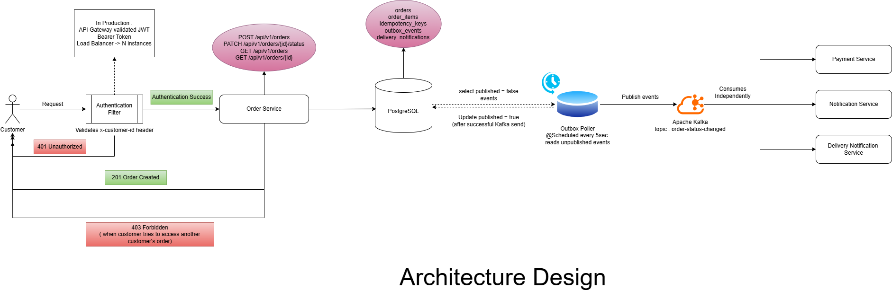
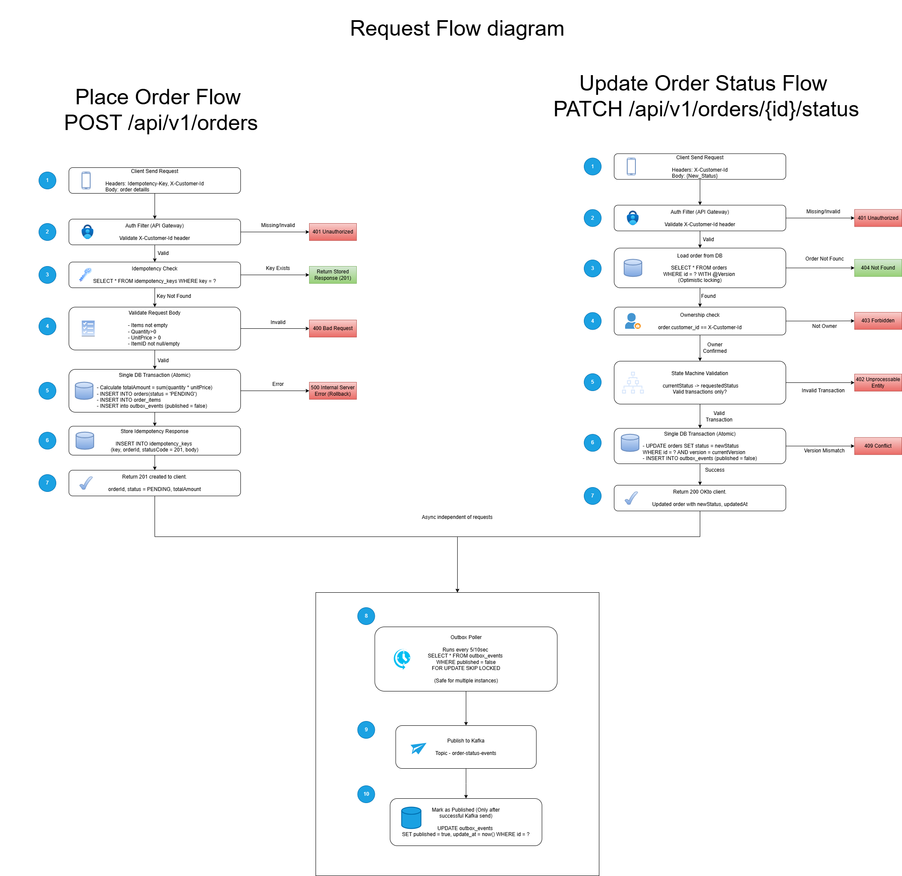

# Order Service

A production-grade order processing service for a food delivery platform. Handles order placement, status lifecycle management, and coordinates with downstream services via Kafka events.

**Stack:** Java 17 · Spring Boot 3.2.5 · PostgreSQL · Apache Kafka · Flyway · Log4j2

---

## Table of Contents

- [Architecture](#architecture)
- [How to Run](#how-to-run)
- [API Overview](#api-overview)
- [Design Decisions](#design-decisions)
- [Failure Analysis](#failure-analysis)
- [Ambiguity Decision](#ambiguity-decision)
- [Status Idempotency](#status-idempotency)
- [What I Would Do Differently](#what-i-would-do-differently)
- [Known Limitations](#known-limitations)

---

## Architecture

### System Design Diagram



### Request Flow Diagram



### Package Structure

```
com.fooddelivery.orderservice
├── config/         KafkaConfig, SwaggerConfig, ApplicationLogger
├── controller/     OrderController, OrderApi (Swagger contract interface)
├── dto/            Request and response DTOs, IdempotencyResult
├── exception/      Domain exceptions, GlobalExceptionHandler
├── filter/         AuthFilter, MdcLoggingFilter
├── kafka/          KafkaOrderEventPublisher, DeliveryNotificationConsumer, OrderStatusChangedEvent
├── mapper/         OrderMapper — all mapping logic in one place
├── model/          Order, OrderItem, OrderStatus, AuditEntity
│                   OutboxEvent, IdempotencyKeyEntity, DeliveryNotificationEntity
├── outbox/         OutboxPoller
├── repository/     OrderJpaRepository, OutboxRepository
│                   IdempotencyKeyRepository, DeliveryNotificationRepository
└── service/        OrderService, OrderTransactionalService
```

---

## How to Run

### Prerequisites

- Docker Desktop
- Java 17
- Maven 3.9+

### Start everything with docker-compose

```bash
# Clone the repository
git clone <repo-url>
cd order-service

# Start PostgreSQL, Zookeeper, Kafka and the application
docker-compose up --build
```

The application starts on `http://localhost:8080`

Swagger UI is available at:

```
http://localhost:8080/swagger-ui/index.html
```

### Run locally (development)

```bash
# Start only infrastructure
docker-compose up postgres zookeeper kafka -d

# Run the application
./mvnw spring-boot:run
```

### Health check

```
GET http://localhost:8080/actuator/health
```

---

## API Overview

All endpoints require the `X-Customer-Id` header.

| Method | Endpoint | Description |
|--------|----------|-------------|
| `POST` | `/api/v1/orders` | Place a new order |
| `PATCH` | `/api/v1/orders/{orderId}/status` | Update order status |
| `GET` | `/api/v1/orders/{orderId}` | Get order by ID |
| `GET` | `/api/v1/orders` | List orders (paginated) |

### Place an order

```bash
curl -X POST http://localhost:8080/api/v1/orders \
  -H "Content-Type: application/json" \
  -H "X-Customer-Id: 550e8400-e29b-41d4-a716-446655440000" \
  -H "Idempotency-Key: order-req-001" \
  -d '{
    "items": [
      {
        "menuItemId": "item-001",
        "name": "Chicken Burger",
        "quantity": 2,
        "unitPrice": 12.99
      },
      {
        "menuItemId": "item-002",
        "name": "French Fries",
        "quantity": 1,
        "unitPrice": 4.99
      }
    ]
  }'
```

**Response — 201 Created**

```json
{
  "id": "15df79bd-e41d-44fc-8de0-48fd6a6bd472",
  "customerId": "550e8400-e29b-41d4-a716-446655440000",
  "status": "PENDING",
  "totalAmount": 30.97,
  "items": [
    {
      "id": "a1b2c3d4-...",
      "menuItemId": "item-001",
      "name": "Chicken Burger",
      "quantity": 2,
      "unitPrice": 12.99,
      "subtotal": 25.98
    },
    {
      "id": "e5f6g7h8-...",
      "menuItemId": "item-002",
      "name": "French Fries",
      "quantity": 1,
      "unitPrice": 4.99,
      "subtotal": 4.99
    }
  ],
  "createdAt": "2024-04-23T12:00:00Z",
  "updatedAt": "2024-04-23T12:00:00Z",
  "version": 0
}
```

### Update order status

```bash
curl -X PATCH http://localhost:8080/api/v1/orders/{orderId}/status \
  -H "Content-Type: application/json" \
  -H "X-Customer-Id: 550e8400-e29b-41d4-a716-446655440000" \
  -d '{"status": "CONFIRMED"}'
```

### Valid status transitions

```
PENDING  ──►  CONFIRMED  ──►  PREPARING  ──►  OUT_FOR_DELIVERY  ──►  DELIVERED
   │               │
   └───────────────┴──►  CANCELLED
```

DELIVERED and CANCELLED are terminal states — no further transitions allowed.

### Get order

```bash
curl http://localhost:8080/api/v1/orders/{orderId} \
  -H "X-Customer-Id: 550e8400-e29b-41d4-a716-446655440000"
```

### List orders

```bash
# All orders for the requesting customer
curl "http://localhost:8080/api/v1/orders?page=0&size=20" \
  -H "X-Customer-Id: 550e8400-e29b-41d4-a716-446655440000"

# Filter by status
curl "http://localhost:8080/api/v1/orders?status=PENDING&page=0&size=20" \
  -H "X-Customer-Id: 550e8400-e29b-41d4-a716-446655440000"
```

---

## Design Decisions

### 1. Transactional Outbox Pattern — DB and Kafka consistency

The biggest challenge in this service is keeping the database write and the Kafka publish consistent. A naive dual-write approach saves to DB and then publishes to Kafka. If the service crashes between the two, the order is saved but the event is never published. Payment is never initiated.

**The solution:** Every status change writes an `outbox_events` row in the same `@Transactional` block as the order mutation. A `@Scheduled` OutboxPoller reads unpublished events every 5 seconds and publishes them to Kafka. Events are marked published only after a confirmed broker acknowledgement.

```
[Single DB transaction]
  UPDATE orders SET status = CONFIRMED
  INSERT INTO outbox_events (published = false)
[Commit]

[OutboxPoller — every 5 seconds]
  SELECT unpublished events FOR UPDATE SKIP LOCKED
  → Kafka.send()
  → UPDATE published = true  (only on success)
```

The transaction uses three dedicated private methods — `persistOrder()`, `persistOutboxEvent()`, and `persistIdempotencyKey()` — each with its own try-catch block for targeted error handling. A `TransactionSynchronizationManager` callback is registered at transaction start and logs `Transaction ROLLED BACK` explicitly if anything fails, giving full visibility into rollbacks in the logs.

Full decision rationale: [docs/ADR-001.md](docs/ADR-001.md)

---

### 2. Idempotency — duplicate order prevention

The `POST /api/v1/orders` endpoint accepts a client-supplied `Idempotency-Key` header. The first request creates the order and stores the exact HTTP response (status code + body) in the `idempotency_keys` table. Any subsequent request with the same key returns the stored response immediately — no duplicate order is created.

The idempotency check happens outside the `@Transactional` block to avoid holding a DB connection during the lookup.

```
Request arrives with Idempotency-Key
         ↓
Check idempotency_keys table
         ↓                              ↓
   Key found                      Key not found
Return stored response         Create order + store response
(same status + body)           (inside one transaction)
```

Race condition handling: if two identical requests arrive simultaneously and both pass the check, the second insert throws `DataIntegrityViolationException` on the unique constraint. This is caught in `persistIdempotencyKey()`, the stored response is fetched and returned — no 500 reaches the client.

---

### 3. Concurrency control — optimistic locking

Concurrent status updates on the same order are handled with optimistic locking via JPA `@Version`. Every UPDATE includes `WHERE version = currentVersion`. If two requests load the same order at version 5 and both try to update, only one succeeds. The other gets an `OptimisticLockException` → `409 Conflict`. The client retries cleanly.

This prevents silent data corruption without the overhead of pessimistic row locking.

---

### 4. State machine — transition enforcement

Valid transitions are defined as a map inside `OrderStatus`:

```
PENDING          → CONFIRMED, CANCELLED
CONFIRMED        → PREPARING, CANCELLED
PREPARING        → OUT_FOR_DELIVERY
OUT_FOR_DELIVERY → DELIVERED
DELIVERED        → (terminal)
CANCELLED        → (terminal)
```

Any transition not in this map returns `422 Unprocessable Entity`. The map is the single source of truth — no scattered if-else chains across the codebase. `isTerminal()` returns true for DELIVERED and CANCELLED — once in these states, no further updates are accepted.

---

### 5. Constructor injection throughout

Every class uses explicit constructor injection instead of `@RequiredArgsConstructor` or field-level `@Autowired`. Spring automatically uses a single constructor for dependency injection — no annotation needed. This makes dependencies visible, fields `final`, and classes independently testable without a Spring context.

---

### 6. Structured logging with correlation IDs

`ApplicationLogger` wraps Log4j2 and is used across every class instead of `@Slf4j`. Every method logs at entry and exit. The `MdcLoggingFilter` injects a `correlationId` (from `X-Correlation-Id` header or auto-generated UUID) into every log line — enabling end-to-end request tracing across all logs.

---

## Failure Analysis

**Scenario: Service crashes after DB write but before Kafka publish**

After the `@Transactional` block commits, the order row and the `outbox_events` row with `published = false` are both safely on disk. The service crashes before `OutboxPoller` can publish the event.

**System state at crash:**
- `orders` table has the correct updated status
- `outbox_events` has an unpublished row with the full event payload
- Kafka has received nothing
- Downstream services are unaware of the change

**Recovery on client retry:**

If this was an order placement (`POST /api/v1/orders`), the client retries with the same `Idempotency-Key`. The idempotency check finds the stored key and returns the original `201 Created` response. No duplicate order is created.

If this was a status update (`PATCH /orders/{id}/status`), the client retries. The service loads the order (already at the new status), `transitionTo()` detects the duplicate, and returns `200 OK` silently. No duplicate outbox event is written.

**Event delivery:**

On restart, `OutboxPoller` wakes up within 5 seconds, finds the unpublished row, and publishes to Kafka. Downstream services receive the event — slightly delayed, but guaranteed.

**Log visibility:**

The `TransactionSynchronizationManager` callback logs the following when a transaction rolls back:

```
Transaction ROLLED BACK — all writes undone customerId=... idempotencyKey=...
```

---

## Ambiguity Decision

**Question: What should happen when a customer requests cancellation of an order that is already DELIVERED?**

**Decision:** Return `422 Unprocessable Entity` with the message: `"Cannot transition order {id} from DELIVERED to CANCELLED"`

**Reasoning:**

DELIVERED is a terminal state. The order has been physically delivered to the customer — there is nothing to cancel at the Order Service level. Any refund or dispute for a delivered order is a separate business concern that belongs to a dedicated Refund or Dispute Service.

Allowing the Order Service to transition a DELIVERED order to CANCELLED would require compensating transactions (driver recall, refund initiation, inventory adjustment) that are out of scope. The state machine keeps the service boundary clean and the responsibility clear.

---

## Status Idempotency

The status update endpoint may be called up to 3 times with the same transition by the internal retry mechanism. `Order.transitionTo()` handles this:

```java
public void transitionTo(OrderStatus newStatus) {
    if (this.status == newStatus) {
        // Already in requested status — return silently
        return;
    }
    // validate and apply transition
}
```

In `OrderService.updateStatus()`:

```java
OrderStatus previousStatus = order.getStatus();
order.transitionTo(requestedStatus);

boolean transitioned = !previousStatus.equals(order.getStatus());

if (transitioned) {
    persistUpdatedOrder(order, previousStatus);
}
```

If the status has not changed (duplicate request):
- No DB write occurs
- No outbox event is written
- No Kafka event is published
- `200 OK` is returned with the current order state

The same Kafka event is never published twice for the same transition.

---

## What I Would Do Differently

**Replace OutboxPoller with Debezium CDC** — reads the PostgreSQL Write-Ahead Log directly and publishes to Kafka with near-zero latency and no DB polling overhead.

**Add API Gateway for authentication** — the simplified `X-Customer-Id` header would be replaced by JWT Bearer token validation at an API Gateway (AWS API Gateway or Kong). The gateway extracts the customer identity and forwards it — the Order Service never handles raw tokens.

**Add outbox cleanup job** — a scheduled job to delete `outbox_events` rows older than the Kafka retention period (7 days) to prevent unbounded table growth.

**Add Dead Letter Topic for failed consumer messages** — if `DeliveryNotificationConsumer` fails to process a message after retries, route it to a Dead Letter Topic for manual inspection rather than silently dropping it.

**Add distributed tracing** — integrate OpenTelemetry with Jaeger or AWS X-Ray for end-to-end request tracing across Order Service, Kafka, and downstream services.

**Add Load Balancer for horizontal scaling** — multiple Order Service instances behind an AWS ALB. The OutboxPoller already handles multi-instance safety via `FOR UPDATE SKIP LOCKED`.

---

## Known Limitations

**No real authentication** — `X-Customer-Id` is a simplified stub. In production this would be a validated JWT token processed by an API Gateway.

**Outbox table grows unboundedly** — published events are never deleted. A cleanup job would be needed in production.

**No retry limit on OutboxPoller** — a permanently broken event will be retried forever. In production a max retry count and Dead Letter Topic would handle this.

**Single Kafka broker** — `docker-compose` runs one Kafka broker. Production would use a multi-broker cluster (minimum 3) with replication factor 3.

**No integration tests** — due to time constraints, only unit tests are included. Integration tests using Testcontainers (real PostgreSQL + embedded Kafka) would be added in a production project.
